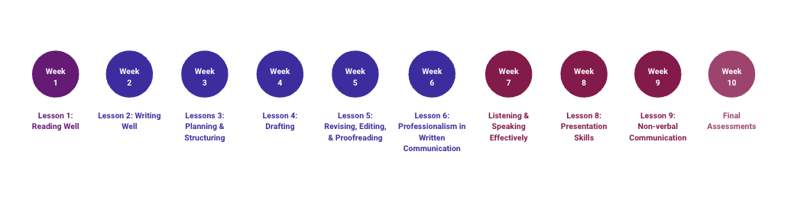

# Course Topics
*Estimated Time: 15 minutes* 

---

Communication skills refer to the ability to effectively exchange information, ideas, and thoughts through speaking, writing, and other forms of communication.

There are several types of communication skills, including:

<aside>
 
**Writing:** 
 
Writing is the process of creating written communication with the use of symbols. It involves selecting and organizing words, sentences, and paragraphs in a way that effectively communicates a message. 

</aside>

<aside>

**Reading:** 
 
Reading is the process of interpreting and understanding written language. It involves using one's eyes to decode the symbols on a page and comprehend the meaning of the words and sentences. 
 
</aside>

<aside>

**Speaking:**
 
Speaking is the process of communicating through spoken language. It involves using one's voice to convey a message to an audience, typically in the form of words and sentences. However, speaking is more than just saying words. It involves considering the needs and interests of the audience, choosing the right words and tone of voice, and organizing the content of the message in a clear and logical way. 
</aside>

<aside>

**Listening:** 
 
Listening is the process of paying attention to and understanding spoken language. It involves using one's ears to hear the words that are being spoken and using one's mind to comprehend the meaning of those words. However, effective listening involves more than just hearing the words that are being spoken. It also involves paying attention to the speaker, interpreting their message, and responding appropriately. 

</aside>

<aside>

**Nonverbal communication:** 
 
Nonverbal communication is the process of communicating without using words. It involves using body language, facial expressions, eye contact, gestures, and other nonverbal cues to convey meaning and emotions. Nonverbal communication can be both intentional and unintentional. It can be used to reinforce or contradict the meaning of spoken words, and it can convey a wide range of emotions and attitudes. 

</aside>
 
These are all actions that we repeatedly perform each day, and it's easy to take them for granted. Have you ever stopped to reflect on how well you do each of these things? Do you think about how your competence in these skills impacts your performance and relationships at home, school, or work? Are you intentional about your approach to these forms of communication? 

Robin Sharma once said, “Awareness precedes choice, and choice precedes change.” The goal of C4S is to help you develop, 1) awareness of what effective and efficient communication looks like, 2) insight into your current skill level, and 3) strategies for improving your skills so that they can support you in achieving your goals.

C4S contains three different parts, during which we will focus on a specific type of communication. The topic for each week is shown in the image below, and each part of the course is described in more detail.

**Part 1 (week 1) - Reading**

Reading is an important part of communication because it allows us to receive and understand written messages from others. Reading enables us to understand and interpret written texts, which can be anything from emails and news articles to novels and poetry. The ability to effectively receive information in written format, is a first step to being able to send back appropriate responses. Reading can help improve your writing skills. When you read, you are exposed to a wide variety of writing styles, language structures, and vocabulary. This can help you develop a sense of what works and what doesn't in terms of writing, and can also help you expand your own writing style and vocabulary. In addition, reading can help you understand the conventions of writing in different genres and disciplines, which can be useful when you are writing in a specific style or for a specific audience. 

With all this in mind, the C4S begins with an exploration of how to read well, so that you can build a strong foundation for the other communication skills that we will explore afterwards.

**Part 2 (week 2 - 6)- Writing**

The second part of this course is focused on writing. 

Written communication in academic and professional settings is important because it allows you to communicate your thoguhts to others across time and space. In a globalised world were you are learning and working with people that aren't in the same location as you, you need to be able to clearly and accurately convey your thoughts and ideas in written form so that they can be understood by others with the direct feedback loops that spoken communication provides. Additiinally, in professional settings, written communication is expected as it allows you to convey longer more complex ideas, while also creating a permanent record that can be referred to at a later time. 

We will be spending 5 weeks focused on written communication, adn the goal is to help you improve both the quality of your writing output, and the efficiency of your writing process.

At the end of week 6, you will submit a midterm project, that will assess your written communication skills.

**Part 3 (week 7-9) - Listening, Speaking, and Non-verbal**

The third part of this course if focused on listening, speaking, and non-verbal communication.  Listening and speaking are the primary ways that we communicate with others on a daily basis. By listening to what others have to say, we can learn new things and understand their perspective. Whereas, speaking allows us to share our own ideas and thoughts with others. Good listening and speaking skills are essential for building strong relationships with others.Speaking clearly and effectively can  help us to build rapport with others and make a good impression, and also allows us to share our own thoughts and ideas and collaborate with others to find solutions.

The final important component of this part of the course is nonverbal communication. Nonverbal communication can have a significant impact on speaking and how a message is received. Nonverbal cues, such as facial expressions, eye contact, posture, and gestures, can affect the meaning and impact of spoken words. For example, nonverbal communication can help to clarify or emphasize the meaning of spoken words. For example, facial expressions and gestures can help to convey emotions or add emphasis to a point. Nonverbal cues, such as eye contact, posture, and tone of voice, can affect how credible a message is perceived to be. For example, someone who speaks confidently and makes strong eye contact may be perceived as more credible than someone who avoids eye contact and speaks uncertainly.

**Week 10 - Final Assessments**

During the final week of the course you will have time to work on the two final assessments.

---
