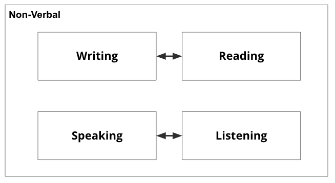

# Course Topics and Expectations
*Estimated Time: 15 minutes* 

---

## Course Topics

Communication skills refer to the ability to effectively exchange information, ideas, and thoughts through speaking, writing, and other forms of communication.

There are several types of communication skills, including:
- **Writing:** the ability to write clearly and effectively, using proper grammar, spelling, and punctuation.

- **Reading:** the reciprocal ability to writing that enables you to understand the meaning of written words, letters, and symbols.
 
- **Speaking:** the ability to speak clearly and effectively, using appropriate language and tone.

- **Listening:** the reciprocal ability to speaking that involves actively listen to others to understand the messages that they are communicating.

- **Nonverbal communication:** the use of body language, facial expressions, and other nonverbal cues to convey meaning and facilitate communication.

These are all actions that we repeatedly perform each day, and it's easy to take them for granted. Have you ever stopped to reflect on how well you do each of these things? Do you think about how your competence in these skills impacts your performance and relationships at home, school, or work? Are you intentional about your approach to these forms of communication? 

Robin Sharma once said, “Awareness precedes choice, and choice precedes change.” The goal of C4S is to help you develop an awareness of what effective and efficient communication looks like, insight into your current skill level, and frameworks for improving your skills so that they can support you in achieving your goals.

C4S contains three different parts, during which we will focus on a specific component of communication. Each phase of the course will be described below in more detail.

**Part 1 (week 1) - Reading**

Reading is an important part of communication because it allows us to receive and understand written messages from others. It is a key way that we can gain knowledge and information, and it is also a way that we can communicate back to others through written language. Reading enables us to understand and interpret written texts, which can be anything from emails and news articles to novels and poetry. The ability to effectively recieve information in written format, is a first step to benig able to send back appropriate responses. Reading is also an important part of language development and literacy, as it helps us learn new words and expand our vocabulary. It is also an important skill for learning and academic success, as it allows us to understand and absorb new concepts and ideas.

Specifically, reading can definitely help improve your writing skills. When you read, you are exposed to a wide variety of writing styles, language structures, and vocabulary. This can help you develop a sense of what works and what doesn't in terms of writing, and can also help you expand your own writing style and vocabulary. In addition, reading can help you understand the conventions of writing in different genres and disciplines, which can be useful when you are writing in a specific style or for a specific audience. Overall, reading is a great way to learn about effective writing and to develop your own writing skills.

With this in mind, the course starts with an exploration of how to read well, so that you can build a strong foundation for the other communication skills that we will explore afterwards.

**Part 2 (week 2 - 6)- Writing**

The second part of this course is focused on writing. The goal of these 5 weeks is to help you improve your writing skills. 

At the end of week 6, you will submit a midterm project, that will assess your written communication skills.

[Add more]

**Part 3 (week 7-9) - Speaking and Non-verbal**

The third part of this course if focused on speaking and non-verbal communication.  You will learn how to effectively deliver presentations and speak in front of groups, which can be useful in many different settings, including the workplace.

[Add more]

**Week 10 - Final assessments**

During the final week of the course you will have time to work on the two final assessments.

---

## Using Technology

This course will require you to complete a lot of reading and writing, and there are now a lot of tools that you can use to support you in refining your skills. 

#### Speech-to-Text: Google Docs Voice Typing

<iframe src="https://www.youtube.com/embed/LIz9UWi5z4w" title="YouTube video player" frameborder="0" allow="accelerometer; autoplay; clipboard-write; encrypted-media; gyroscope; picture-in-picture" allowfullscreen style="position: absolute; top: 0; left: 0; width: 100%; height: 100%;"></iframe>

#### **Google Docs Grammar and Spelling Checker**

It is important to use a spelling and grammar checker when writing because it can help you catch errors and improve the overall quality of your writing. Spelling and grammar mistakes can be distracting for readers and can make your writing seem careless or unprofessional. A spelling and grammar checker can help you identify and correct these mistakes, improving the clarity and credibility of your writing. In addition, using a spelling and grammar checker can help you improve your own language skills. By highlighting errors and suggesting corrections, a spelling and grammar checker can help you learn from your mistakes and become a better writer.

<iframe src="https://www.youtube.com/embed/jFVJve3Y4sY" title="YouTube video player" frameborder="0" allow="accelerometer; autoplay; clipboard-write; encrypted-media; gyroscope; picture-in-picture" allowfullscreen style="position: absolute; top: 0; left: 0; width: 100%; height: 100%;"></iframe>

#### Text-to-Speech: Natural Reader 

<iframe src="https://www.youtube.com/embed/LQRi6d95AD0" title="YouTube video player" frameborder="0" allow="accelerometer; autoplay; clipboard-write; encrypted-media; gyroscope; picture-in-picture" allowfullscreen style="position: absolute; top: 0; left: 0; width: 100%; height: 100%;"></iframe>

---
## Attendance and Engagement

Please make sure you have reviewed all the Kibo Academic Policies that are found in the [Catalog](https://bit.ly/ks-catalog-oct2022).

The general Kibo attendance and engagement policy is as follows:

Students are required to remain academically engaged during each week of the term. Academic engagement can include:
- Attending a scheduled session (e.g., live class or office hours) where there is opportunity for interaction with the instructor and/or peers
- Submitting an academic assignment, quiz, or project
- Taking an exam, or engaging in online tutorial or instruction
- Attending a study group that is assigned by the instructor
- Participating in an online discussion about academic matters
- Initiating contact with an instructor to ask a question about the class

Unless otherwise noted, the general requirement for participation and academic engagement is:
- No more than one unexcused week of non-engagement per term in any class
- No more than two excused (communicated in advance) weeks of non-engagement per term in any class

For this course specifically, you are expected to engage in the online discussion and reflection questions and activities that are embedded throughout the online lessons. 

You are also expected to attend the weekly 90 minute live class. If you are unable to attend the live class, you are required to notify the instructor at least 24 hours in advance of the live class that you will be missing, and you will be provided with an additional assignment to make up for the live class that you will not be attending. 

If you have any questions, please be sure to post them in the #help-c4s channel in Discord, and the instructor will be able to answer your question there.

---
## Academic Integrity

This course is run in accordance with Kibo School's Academic Honesty and Integrity Policy, which can also be found in the [Catalog](https://bit.ly/ks-catalog-oct2022). We have a zero tolerance policy towards all forms of academic misconduct, including cheating, plagiarism, and fabrication. If you are found to be in breach of the Academic Honesty and Integrity Policy in any of the assignments that you submit, you will be subject to disciplinary action. 

Note that assisting another student in the violation of this policy also constitutes a violation of academic integrity (e.g. letting someone copy your assignment counts as a violation for both the person that copied the work and the original owner of the copied work).

---
## Assignment Deadlines
All weekly assignments have a stated assignment deadline on their assignment page by which the assignment must be submitted in order to get full marks. Late submissions will be subject to at least a 25% deduction in the marks available. 

---
## Communication Expectations

The most effective way to communicate with the instructor for this course is through posting a message in the #help-c4s channel in Discord. All questions posted there will receive a response within 24 hours. 

All course announcements from the instructor will also be posted to the pinned announcement in the #help-c4s channel in Discord.

---
