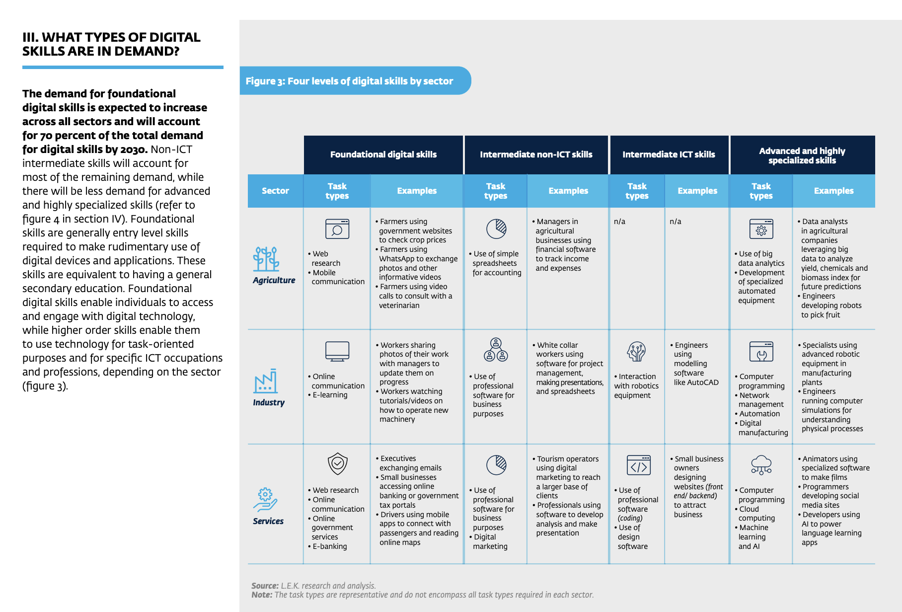

# Final Assessments

---

> 📝 Complete the two final asessments below

Due date: March 17th, 10pm GMT

## 1) Final Project: Kibo Digital Literacy Fellowship Application (20% of Final Grade)

**Kibo Digital Literacy Fellowship Overview**

Expanding digital skills is an imperative for Africa. Technology is changing the nature of work, and companies in all sectors are increasingly digitizing their operations. However, African employers have a large, unmet need for employees with digital skills. According to a [report](https://www.ifc.org/wps/wcm/connect/b5ad161e-a2e2-4010-86f2-54717e68b239/Demand+for+Digital+Skills+in+Sub-Saharan+Africa_web.pdf?MOD=AJPERES&CVID=nEldzv7) by the International Finance Corporation and World Bank, by 2030, 50-55% of all jobs in Kenya will require digital skills, as will 35-45% of jobs in Nigeria and 20-25% of all jobs in Africa overall. The majority of demand is in “foundational digital skills,” such as web research, and mobile and online communication. 

Yet, young Africans lack these skills. Boston Consulting group estimates that only 11% of African university graduates are well-trained in basic digital skills, and anecdotal [stories](https://twitter.com/ChetoManji/status/1409153757036826628) support this. 

So, **How might we increase the foundational digital skills of Africans so that they can access the jobs of the future?**

The Kibo Digital Literacy Fellowship will provide a grant to support projects that directly increase the foundational digital skills of underserved Africans. Applicants are invited to propose projects that will have a measurable impact on increasing the foundational digital skills for people in their  communities. The IFC and World Bank report gives some good examples of foundational digital skills (see image below), however proposals for additional foundational digital skills are welcomed.

[Source](https://www.ifc.org/wps/wcm/connect/b5ad161e-a2e2-4010-86f2-54717e68b239/Demand+for+Digital+Skills+in+Sub-Saharan+Africa_web.pdf?MOD=AJPERES&CVID=nEldzv7)

### Project Instructions

Your task for the C4S final project is to put together an application for the Kibo Digital Literacy Fellowship (described above). Your application needs to include:

- A personal statement introducing yourself and describing your past experiences and motivations (250 - 500 words)
- A proposal describing the digital literacy project you would like to use the grant money for. (500 - 1000 words)
- A 1-2 minute video pitching your project idea.

In addition to you receiving a final grade for this project, all submissions will be reviewed by a judging panel from the Kibo community, and 4 submissions will receive USD 250 to implement their project.

### Submission

Your project submission should include:

- Your personal statement (please also include the planning questions, outline, and 7Cs evaluation for your personal statement)
- Your project proposal (please also include the planning questions, outline, and 7Cs evaluation for your project)
- Your pitch video

Submit your assignment on Gradescope and then upload a copy to the Week 10 submission area on the Woolf platform.

---

## 2) Final Essay: C4S Reflection Blog (20% of Final Grade)

Your task for your final essay is to write a blog post decribing your experience in the Communicating for Success class.

Your blog post should include the following information, however you should create an outlkne to decide the order in which you want to present this information:

- How you felt about your communication skills at the start of C4S
- How you feel about your communication skills at the end of C4S
- The goals you had for improving your communication skills at the start of C4S
- A description of your experience over the 10 weeks of C4S
- The most impactful thing you learned during C4S
- The greatest challenge you faced during C4S
- Something you are proud of from your C4S experience
- Something you wish you had known at the start of C4S
- Advice you would give someone who will take C4S in the future

When writing your blog post, make sure you answer the planning questions, create an outline, and evaluate your blog post using the 7Cs.

### Submission

Your submission should include:
- Your answers to the planning questions
- Your outline
- Your evalaution using the 7Cs
- Your final blog post

Submit your assignment on Gradescope and then upload a copy to the Week 10 submission area on the Woolf platform.

---

