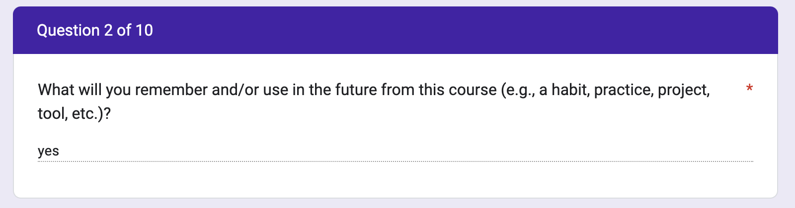

# Motivation

*Estimated Time: 45 minutes*

---

<aside>
  
🗣 **“Reading is to the mind what exercise is to the body.”** 

- Joseph Addison
  
</aside>

---

## How We Read

Have you ever thought about what actually happens when you read? 

> 📺 Watch the following video on the science behind reading.

<iframe src="https://www.youtube.com/embed/Wt7rR0MCYsg" title="YouTube video player" frameborder="0" allow="accelerometer; autoplay; clipboard-write; encrypted-media; gyroscope; picture-in-picture" allowfullscreen style="position: absolute; top: 0; left: 0; width: 100%; height: 100%;"></iframe>

<aside>
From the video:
  
"It's because all you're ever seeing is your internal model of the outside world. You're not seeing the world as it is because it actually takes time for your eye to move from one place to another. So what happened in that time? Well, it turns out your brain says, “Okay, I'm going to fill in the gap with whatever I land in.” When your eyes land on the thing. You've got this gap in time, and so your brain essentially retrospectively fills that in.”
 
- David Eagleman

</aside>

One of the most interesting takeaways from the above video is that our brain doesn't process exactly what is on a page, instead it processes pieces of what is on the page and fills in the gaps with what it thinks is there. 🤯

So if you've ever taken an exam and missed a question because you read it incorrectly. Or answered a feedback survey question like the example in the image below. It might be because your brain is incorrectly filling in the gaps as it moves between words!

**Note:** One potential solution to this issue is to slow down when reading and use other context clues to sanity check what you think you have read!

---

## Benefits of Reading

> 📺 Watch this video to learn about the benefits of reading.

<iframe src="https://www.youtube.com/embed/PgU9vaHBVaY" title="YouTube video player" frameborder="0" allow="accelerometer; autoplay; clipboard-write; encrypted-media; gyroscope; picture-in-picture" allowfullscreen style="position: absolute; top: 0; left: 0; width: 100%; height: 100%;"></iframe>

---

## Reflection: Reading

<aside>

🪞 **Answer the following questions in the padlet below.**  

1) Do you like to read? Why or why not?

2) What sort of reading do you enjoy the most? Why?

3) What sort of reading do you dislike the most? Why?
  
</aside>

<iframe src="https://padlet.com/embed/2qu2tvbc6nj4sk8j" frameborder="0" allow="camera;microphone;geolocation" style="width:100%;height:608px;display:block;padding:0;margin:0"></iframe>

---

## Reading Practice!

> 📖 [Read this](https://www.zmescience.com/science/news-science/smartphone-power-compared-to-apollo-432/), then submit a 100-word summary of the reading in the pallet below.

<iframe src="https://padlet.com/curriculumpad/wvp92d3k78e3rk8y" frameborder="0" allow="camera;microphone;geolocation" style="width:100%;height:608px;display:block;padding:0;margin:0"></iframe>

---
